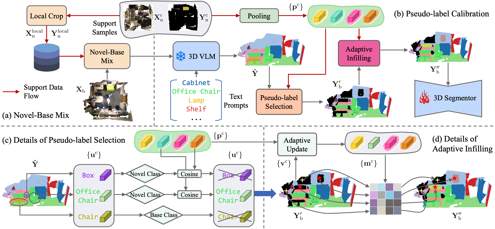

<p align="center">
  <h1 align="center">Generalized Few-shot 3D Point Cloud Segmentation with Vision-Language Model</h1>
  <p align="center">
    <a href="https://zhaochongan.github.io/"><strong>Zhaochong An</strong></a>
    ·
    <a href="https://guoleisun.github.io/"><strong>Guolei Sun<sup>†</sup></strong></a>
    ·
    <a href="https://yun-liu.github.io/"><strong>Yun Liu<sup>†</sup></strong></a>
    ·
    <a href="https://runjiali-rl.github.io/"><strong>Runjia Li</strong></a>
    ·
    <a href="https://junlinhan.github.io/"><strong>Junlin Han</strong></a>
    <br>
    <a href="https://people.ee.ethz.ch/~kender/"><strong>Ender Konukoglu</strong></a>
    ·
    <a href="https://sergebelongie.github.io/"><strong>Serge Belongie</strong></a>
  </p>
  <h2 align="center">CVPR 2025 (<a href="https://arxiv.org/pdf/2503.16282">Paper</a>)</h2>
</p>

<p align="center">
  
</p>


## 🌟 Highlights


### Key Contributions:

**Model Side:**

- **GFS-VL Framework:** A novel approach for generalized few-shot 3D point cloud segmentation (GFS-PCS) that combines **Dense yet noisy knowledge** from 3D Vision-Language Models and **Precise yet sparse few-shot samples** to achieve superior novel class generalization.

**Benchmarking Side:**

- Introduces **two challenging GFS-PCS benchmarks with diverse novel classes** for extensive generalization evaluation, laying a solid foundation for real-world GFS-PCS advancements.


## 📝 Citation
If you find our work useful, please cite our work:
```bibtex
@inproceedings{an2025generalized,
  title={Generalized Few-shot 3D Point Cloud Segmentation with Vision-Language Model},
  author={An, Zhaochong and Sun, Guolei and Liu, Yun and Li, Runjia and Han, Junlin and Konukoglu, Ender and Belongie, Serge},
  booktitle={CVPR},
  year={2025}
}

@inproceedings{an2024multimodality,
    title={Multimodality Helps Few-Shot 3D Point Cloud Semantic Segmentation},
    author={An, Zhaochong and Sun, Guolei and Liu, Yun and Li, Runjia and Wu, Min 
            and Cheng, Ming-Ming and Konukoglu, Ender and Belongie, Serge},
    booktitle={ICLR},
    year={2025}
}

@inproceedings{an2024rethinking,
  title={Rethinking Few-shot 3D Point Cloud Semantic Segmentation},
  author={An, Zhaochong and Sun, Guolei and Liu, Yun and Liu, Fayao and Wu, Zongwei and Wang, Dan and Van Gool, Luc and Belongie, Serge},
  booktitle={Proceedings of the IEEE/CVF Conference on Computer Vision and Pattern Recognition},
  pages={3996--4006},
  year={2024}
}
```
---

## 📖 Table of Contents

- [Installation](#%EF%B8%8F-installation)
- [Data Preparation](#-data-preparation)
- [Training](#-training)
- [Evaluation & Visualization](#-evaluation--visualization)
- [Model Zoo](#-model-zoo)
- [Acknowledgement](#acknowledgement)

---


## 🛠️ Installation

### Requirements

- **CUDA**: 11.8 and above
- **PyTorch**: 1.13.0 and above

Our environment is tested on both RTX 3090 and A100 GPUs.

### Environment Setup:

**Manual Setup**

```bash
python -m venv gfs_vl
source gfs_vl/bin/activate

pip install torch==2.1.0 torchvision==0.16.0 torchaudio==2.1.0 --index-url https://download.pytorch.org/whl/cu118
pip install h5py pyyaml ninja sharedarray tensorboard tensorboardx addict einops scipy plyfile termcolor timm urllib3 fsspec==2024.2.0 easydict==1.13 yapf==0.40.1
pip install torch-cluster torch-scatter torch-sparse -f https://data.pyg.org/whl/torch-2.1.0+cu118.html
pip install torch-geometric
pip install git+https://github.com/openai/CLIP.git
pip install flash-attn --no-build-isolation
pip install spconv-cu118 # see https://github.com/traveller59/spconv for details

# Pointops CUDA Dependencies (choose one of the three options)
cd libs/pointops
# Option 1: Standard install
python setup.py install
# Option 2: Docker & Multi-GPU arch
TORCH_CUDA_ARCH_LIST="ARCH LIST" python setup.py install
# Option 3: For RTX 3090 (8.6) or A100 (8.0). More details in: https://arnon.dk/matching-sm-architectures-arch-and-gencode-for-various-nvidia-cards/
TORCH_CUDA_ARCH_LIST="8.0" python setup.py install

# For the second CUDA dependency, use the same one of three above build options
cd ../../libs/pointops2
TORCH_CUDA_ARCH_LIST="8.0" python setup.py install
```

After above steps, install dependencies for the 3D vision-language models (RegionPLC). Refer to the [RegionPLC installation guide](https://github.com/CVMI-Lab/PLA/blob/regionplc/docs/INSTALL.md).

```bash
cd pointcept/models/PLA
TORCH_CUDA_ARCH_LIST="8.0" python3 setup.py develop

# Install softgroup_ops:
cd pcseg/external_libs/softgroup_ops
TORCH_CUDA_ARCH_LIST="8.0" python setup.py build_ext develop

# If the direct install fails, follow these steps:
# 1. Download google-sparsehash-2.0.3-1.tar.bz2 from:
#    https://anaconda.org/bioconda/google-sparsehash/files
# 2. Extract it:
tar -I pigz -xvjf google-sparsehash-2.0.3-1.tar.bz2 -C ./google-sparsehash
# 3. Set include path:
export CPLUS_INCLUDE_PATH=$(pwd)/google-sparsehash/include:$CPLUS_INCLUDE_PATH
# 4. Build with the include directories:
TORCH_CUDA_ARCH_LIST="8.0" python setup.py build_ext --include-dirs=$CPLUS_INCLUDE_PATH develop
```

## 📦 Data Preparation

We follow the [Pointcept Data Guidelines](https://github.com/Pointcept/Pointcept#data-preparation).

### ScanNet & ScanNet200

1. Download the [ScanNet v2 dataset](http://www.scan-net.org/).
2. Preprocess the raw data:
    ```bash
    # Set RAW_SCANNET_DIR to your downloaded dataset directory
    # Set PROCESSED_SCANNET_DIR to the desired output directory
    python pointcept/datasets/preprocessing/scannet/preprocess_scannet.py \
      --dataset_root ${RAW_SCANNET_DIR} \
      --output_root ${PROCESSED_SCANNET_DIR}
    ```

- *(Alternative)*: Download our preprocessed data from [here](https://huggingface.co/datasets/ZhaochongAn/GFS_PCS_Datasets/blob/main/ScanNet200.tar.gz) (please agree to the official license).


After obtaining the dataset, either set `data_root` in configs to `${PROCESSED_SCANNET_DIR}` or link the processed data:
  ```bash
  ln -s ${PROCESSED_SCANNET_DIR} ${CODEBASE_DIR}/data/ScanNet200
  ```

### ScanNet++

1. Download the [ScanNet++ dataset](https://kaldir.vc.in.tum.de/scannetpp/).
2. Preprocess the raw data:
    ```bash
    # Set RAW_SCANNETPP_DIR to your downloaded dataset directory
    # Set PROCESSED_SCANNETPP_DIR to the desired output directory
    # NUM_WORKERS: number of parallel workers
    python pointcept/datasets/preprocessing/scannetpp/preprocess_scannetpp.py \
      --dataset_root ${RAW_SCANNETPP_DIR} \
      --output_root ${PROCESSED_SCANNETPP_DIR} \
      --num_workers ${NUM_WORKERS}
    ```
3. Sampling and chunking large point cloud data in train/val split (for training only):
    ```bash
    # For the training split (change --split to val for the validation split):
    python pointcept/datasets/preprocessing/sampling_chunking_data.py \
      --dataset_root ${PROCESSED_SCANNETPP_DIR} \
      --grid_size 0.01 \
      --chunk_range 6 6 \
      --chunk_stride 3 3 \
      --split train \
      --num_workers ${NUM_WORKERS}
    ```

- *(Alternative)* Download our preprocessed data directly from [here](https://huggingface.co/datasets/ZhaochongAn/GFS_PCS_Datasets/blob/main/ScanNetpp.tar.gz) (please agree to the official license).

After obtaining the dataset, either set `data_root` in configs to `${PROCESSED_SCANNET_DIR}` or link the processed data:
  ```bash
  ln -s ${PROCESSED_SCANNETPP_DIR} ${CODEBASE_DIR}/data/ScanNetpp
  ```

## 🔄 Training

### 1. Backbone Pretraining

- **Option A**: Download our [Pretrained weights](https://huggingface.co/ZhaochongAn/GFS_VL/tree/main/backbone_weights)
- **Option B**: Train from scratch using the pretrain config from the `configs` folder. Training outputs will be saved into the folder specified by `${EXP_NAME}`.

  ```bash
  sh scripts/train.sh -p python -d scannet200 -c semseg-pt-v3m1-0-gfspretrain -n ${EXP_NAME} -g 4
  ```

> Replace `-d scannet200` with `scannet` or `scannetpp` when training on those datasets.

### 2. Registration Training

- Set the configuration file (`-c`) to:
  - `semseg-pt-v3m1-0-gfsregistrain_k1.yaml` for 1-shot registration.
  - `semseg-pt-v3m1-0-gfsregistrain_k5.yaml` for 5-shot registration.

- Download the pretrained 3D VLM weights from [Regionplc repo](https://connecthkuhk-my.sharepoint.com/personal/jhyang13_connect_hku_hk/_layouts/15/onedrive.aspx?id=%2Fpersonal%2Fjhyang13%5Fconnect%5Fhku%5Fhk%2FDocuments%2Fpretrained%5Fmodels%2Fregionplc%2Fpretrained%5Fmodels%2Fsem%5Fseg%2Fscannet%5Fannotation%5Ffree%2Fsparseunet32%5F636%2Epth&parent=%2Fpersonal%2Fjhyang13%5Fconnect%5Fhku%5Fhk%2FDocuments%2Fpretrained%5Fmodels%2Fregionplc%2Fpretrained%5Fmodels%2Fsem%5Fseg%2Fscannet%5Fannotation%5Ffree&ga=1) or [our Huggingface repo](https://huggingface.co/ZhaochongAn/GFS_VL/tree/main/3d_vlm_weight).
- Update the config file by setting (`-o`):
  - `vlm_3d_weight`: path to the pretrained VLM weight.
  - `backbone_weight`: path from Backbone Pretraining.
  - `data_root`: corresponding dataset folder.

The `regis_train_list` field controls the registration sets to use (By default, training is performed on five different sets; the final performance is reported as an average).

For example, for ScanNet200 (1-shot):
```bash
sh scripts/train.sh -p python -d scannet200 -c semseg-pt-v3m1-0-gfsregistrain_k1 -n ${EXP_NAME} -g 4
```
> Replace `-d scannet200` with `scannet` or `scannetpp` when training on those datasets.

## 📊 Evaluation & Visualization

###  Evaluation
By default, five fine-tuned weights (from five registration sets) are saved. To evaluate a specific weight, use the `-w` option:

```bash
sh scripts/test.sh -p python -d scannet -c semseg-pt-v3m1-0-gfsregistrain_k1 -n ${EXP_NAME} -w regis1_model_last -g 4
```

> **Note**: Our evaluation is performed on whole scenes (unlike prior evaluations only on small blocks) to better simulate real-world scenarios.


### Visualization

Add `-o vis VISUALIZATION_SAVE_PATH` to the evaluation command to automatically save files for visualization. Then, follow the [COSeg visualization guide](https://github.com/ZhaochongAn/COSeg?tab=readme-ov-file#visualization) for high-quality visualization results.


## 🎯 Model Zoo

| Model | Dataset | K-shot | Weights |
|:-------:|:---------:|:------------:|:----------:|
| sc_k1 | ScanNet | 1-shot | [Download](https://huggingface.co/ZhaochongAn/GFS_VL/tree/main/sc_k1) |
| sc_k5 | ScanNet | 5-shot | [Download](https://huggingface.co/ZhaochongAn/GFS_VL/tree/main/sc_k5) |
| sc200_k1 | ScanNet200 | 1-shot | [Download](https://huggingface.co/ZhaochongAn/GFS_VL/tree/main/sc200_k1) |
| sc200_k5 | ScanNet200 | 5-shot | [Download](https://huggingface.co/ZhaochongAn/GFS_VL/tree/main/sc200_k5) |
| scpp_k1 | ScanNet++ | 1-shot | [Download](https://huggingface.co/ZhaochongAn/GFS_VL/tree/main/scpp_k1) |
| scpp_k5 | ScanNet++ | 5-shot | [Download](https://huggingface.co/ZhaochongAn/GFS_VL/tree/main/scpp_k5) |


## Acknowledgement

This repository is developed by [Zhaochong An](https://zhaochongan.github.io/) and builds upon the excellent works of [COSeg](https://github.com/ZhaochongAn/COSeg), [Pointcept](https://github.com/Pointcept/Pointcept), [RegionPLC](https://github.com/CVMI-Lab/PLA/tree/regionplc), and [Openscene](https://github.com/pengsongyou/openscene). Many thanks to all contributors!

For questions or issues, feel free to reach out:

- **Email:** anzhaochong@outlook.com
- **Join our Communication Group (WeChat):**

<div style="text-align: left;">
    
</div>